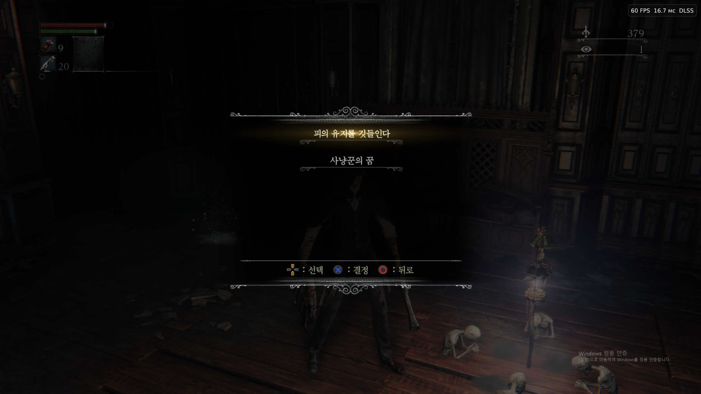
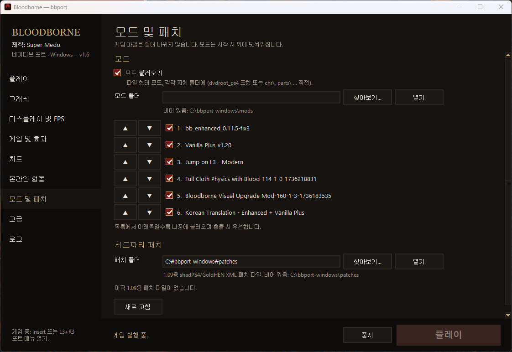

# 블러드본 Enhanced + Vanilla Plus 한글 패치

**BB Enhanced**와 **Vanilla Plus** 모드를 한글로 즐길 수 있게 해주는 번역 모드입니다.
두 모드를 한글 패치와 같이 쓰면 새로 추가된 무기·아이템·메뉴가 `???`로 나오는 문제를 해결합니다.

- 원본 게임의 **공식 한글 번역**은 그대로 유지
- 두 모드가 추가·변경한 텍스트 **3,241개를 한글로 번역**
  (아이템·무기·방어구 이름과 설명, Enhanced 기능 메뉴, 소환 메시지 등)
- 고유명사는 공식 한글판 용어를 따름 (장치 무기, 계몽, 피의 유지, 카릴의 유고 …)
- **한글 폰트 포함** — 다른 한글 패치 없이 이 모드 하나만 넣으면 됩니다



## 필요한 것

| 항목 | 버전 |
|---|---|
| 게임 | Bloodborne GOTY (CUSA03173) v1.09 |
| BB Enhanced | 0.11.5-fix3 |
| Vanilla Plus | v1.20 |

shadPS4 계열 PC 포트(bbport 등)의 `mods` 폴더 방식 기준으로 만들었습니다.

## 설치

1. [Releases](../../releases)에서 zip 파일을 받습니다.
2. 압축을 풀어 `Korean Translation - Enhanced + Vanilla Plus` 폴더를 `mods` 폴더에 넣습니다.
3. 모드 목록의 **맨 아래**에 둡니다. (아래쪽일수록 나중에 불러와서 우선 적용돼요)
4. **다른 한글 패치는 필요 없습니다.** 한글 폰트·메시지 모드가 있다면 꺼 주세요. (같은 파일을 덮어써서 충돌합니다)



게임 언어는 영어(English)로 두면 됩니다. `engus`·`enggb` 둘 다 들어 있어요.

## 알아두면 좋은 점

- 공식 번역이 없는 모드 전용 이름은 새로 지었습니다.
  예: 유령 토큰 / 유령 상점, 점화의 의식, 카릴의 유고 "거대한 호수 Lv.1"
- Vanilla Plus의 영어 문장 다듬기(영국식 철자, 띄어쓰기 등)는 의미가 같아서 공식 한글을 유지했습니다.
- 어색한 번역이나 깨지는 텍스트를 발견하면 [Issues](../../issues)에 알려 주세요.

## 직접 빌드하기

모드가 업데이트되면 [`tools`](tools) 폴더의 스크립트로 다시 만들 수 있습니다.
Windows PowerShell 5.1만 있으면 되고, 별도 설치는 필요 없습니다.

```
build.ps1  → 원본 한글 + 모드 메시지 병합
prep.ps1   → 영어로 남은 항목 수집 (공식 번역 자동 재사용)
batch.ps1  → 아직 번역 안 된 새 문장만 batch_N.json 으로 추출
             (번역해서 batch_N.out.json 으로 저장)
apply.ps1  → 번역 적용 + 폰트 포함 모드 폴더 생성
```

자세한 내용은 [`tools/README.txt`](tools/README.txt)를 참고하세요.
스크립트 안의 경로(`C:\bbport-windows`)는 자기 환경에 맞게 고쳐 주세요.

## 크레딧

- 원작: Bloodborne © Sony Interactive Entertainment / FromSoftware
- BB Enhanced, Vanilla Plus 모드 제작자분들
- 한글 폰트: "normal hangul, eng embed" 폰트 모드 제작자분
- 번역 및 병합 도구: kairess

이 프로젝트는 비공식 팬 번역이며, 원작 및 각 모드의 권리는 해당 제작자에게 있습니다.
